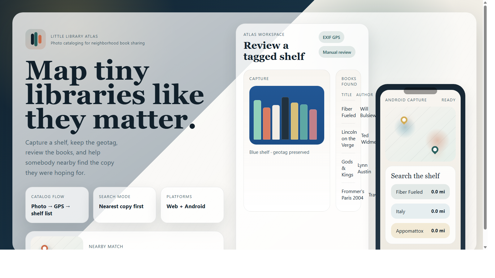

# Little Library Atlas

Little Library Atlas is a lightweight prototype for cataloging sidewalk mini-libraries from a photo and making nearby-book lookup possible from one shared central database.

The website is the source of truth. People can contribute by uploading a shelf photo on the website, or by using the Android app to capture/review a shelf and sync it to the same website database.

## What it does

- Takes a library photo from a browser file picker or phone camera.
- Pulls geolocation from photo EXIF GPS when it exists.
- Falls back to browser geolocation when the user allows it.
- Uses the OpenAI Responses API to extract visible books and metadata into JSON.
- Lets a human review and edit the draft before saving.
- Stores libraries and books in a central SQLite database file.
- Searches the database by title, author, or ISBN and ranks matches by distance.
- Accepts Android app contributions through `POST /api/mobile/libraries`.

## Project layout

- [app.py](app.py)
- [static/index.html](static/index.html)
- [static/styles.css](static/styles.css)
- [static/app.js](static/app.js)
- [android-app](android-app)
- [assets/github-banner.html](assets/github-banner.html)

## Run the central website

1. Set an OpenAI key if you want automated book extraction.

```powershell
$env:OPENAI_API_KEY="your-key-here"
```

2. Start the app.

```powershell
python app.py
```

3. Open `http://127.0.0.1:8000`.

For a public deployment, run the same app on a host with persistent storage for `data/`, set `HOST=0.0.0.0`, and use the platform-provided `PORT` if needed. Use HTTPS for the public URL that Android users enter in the app.

```powershell
$env:HOST="0.0.0.0"
$env:PORT="8000"
python app.py
```

## Ingest a local photo

The CLI ingest path is useful when you already have a photo on disk and a reviewed metadata JSON file.

```powershell
python scripts\ingest_photo.py "C:\Users\xliup\Downloads\PXL_20260328_161848034 (1).jpg"
```

The default metadata file is [samples/blue_little_library_books.json](samples/blue_little_library_books.json). The script copies the photo into `data/uploads`, extracts EXIF GPS, inserts the library and books into SQLite, then runs a verification search.

## Android app

The repo includes an Android app in [android-app](android-app). It keeps an on-device copy for offline review, and when a contributor enters the central website URL, `Save + sync to website` uploads the reviewed shelf and optional photo to the central database.

```powershell
$env:ANDROID_HOME="$env:LOCALAPPDATA\Android\Sdk"
$env:ANDROID_SDK_ROOT="$env:LOCALAPPDATA\Android\Sdk"
cd android-app
.\gradlew.bat assembleDebug
```

On Windows, the debug APK is written outside the OneDrive repo tree to avoid Gradle file-lock issues:

```text
%LOCALAPPDATA%\LittleLibraryAtlasAndroidBuild\app\outputs\apk\debug\app-debug.apk
```

GitHub Actions also builds the debug APK automatically through [.github/workflows/android-apk.yml](.github/workflows/android-apk.yml).

For local testing against a laptop server, start the website with `HOST=0.0.0.0` and enter a reachable URL such as `http://192.168.1.23:8000` in the Android app. Production deployments should use HTTPS.

## Banner image

The GitHub banner image is [assets/github-banner.png](assets/github-banner.png). Its source is the tracked HTML/CSS pair [assets/github-banner.html](assets/github-banner.html) and [assets/github-banner.css](assets/github-banner.css), which lets us regenerate the banner without ever committing the original library photo.

## Notes

- If `OPENAI_API_KEY` is not set, the app still works in manual review mode.
- The default model is `gpt-4.1-mini`. Set `OPENAI_VISION_MODEL` if you want a different OpenAI vision-capable model.
- The shared database lives at `data/little_library_atlas.db`.
- This prototype uses SQLite for simplicity. For multi-server production deployment, move the same schema to Postgres.
- Raw phone photos are intentionally ignored by Git so the original capture files do not get pushed to GitHub.
